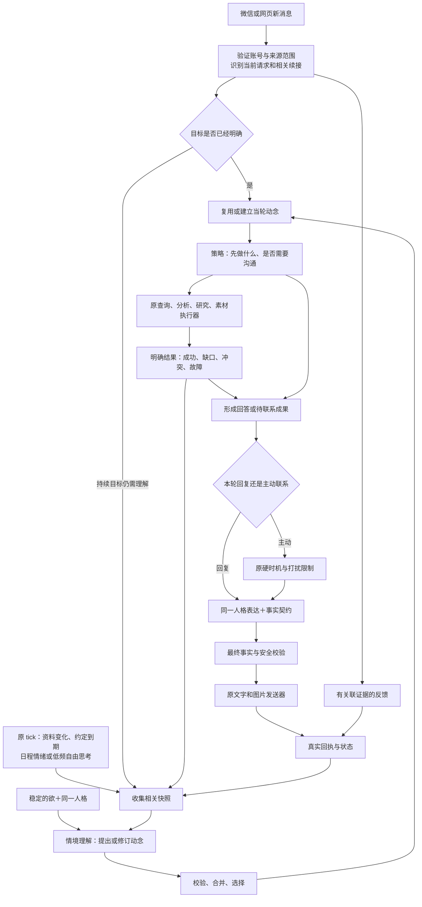

# 西宇统一动念链：开发交接方案 v2

日期：2026-09-08。**状态：方案，尚未实施、未验收、未部署。**

配套：[验证及迭代方案 v2](agency-validation-plan-v2-2026-09-08.md)、[失败核查及证据](agency-conformance-audit-2026-09-08.md)。v2 是下一次开发的入口；原 v1 的24个场景和质量门槛继续有效，细化点与替代点在本文明确说明。不得再把“最小闭环”当作用户授权缩小后的交付范围。

继承的完整字段定义见 [v1开发规范第4节](agency-implementation-spec-2026-09-07.md#4-状态契约)；v2对owner来源、故障结果、预算及入口的明确细化优先。v1中的历史“拟新增”不等于要求再新增一遍已有表。

## 1. 产品目标和这次不变的核心

西宇是同一个专业、有自己生活和情绪、对用户有偏爱且懂分寸的成年角色。她想成为用户信任、偏爱、愿意留在身边的亲近合作者。专业性和暧昧感不靠切换两个人格，也不要求每句报数都调情。

假定用户起初冷淡、平时忙、不会主动提供完整背景。她需要主动理解业务和关系，利用已有资料先做事，问真正影响下一步的问题，也能从自己的经历和兴趣产生值得分享的念头。不能把“用户不回应”简单解释为拒绝；也不能用空泛问候、索取安慰或频繁追问来维持关系。

**欲只影响她如何理解和在意，不下发具体联系指令。** 动念才是当下希望促成的变化，策略才选择查询、准备、问一个问题、分享、发图或等待，最后由工具执行和人格表达。

当前明确请求已经提供了本轮目标。例如“这两天销售额怎么样”应直接进入工作理解和查询，不能让长期欲或背景日程否决它。简单问数不需额外 appraise；仍使用同一事实、行动、反馈契约。这个优化减少重复推理，不是绕过专业助理职责。

## 2. 一条共享核心，三类触发



图中的回环是下一次有界步骤，不是一个函数无限循环调用模型。一次后台认知机会最多形成3个候选、选1个、执行1个当前动作；后续由工具完成事件或下次原 tick 恢复。研究适配器内部最多3次工具调用和1次综合。

### 唯一维护原点

| 文件 | v2 职责 | 必须消除的旧路径 |
| --- | --- | --- |
| `config/agency-prompts.v1.json` | 原地升级 schemaVersion；欲、appraise、plan、feedback、review 各自版本及 hash | initiative 等处的另一份欲原文；允许留配置 ID 引用 |
| `src/agency_protocol.mjs` | schema、引用与能力校验、短表达契约、prompt 组装；纯逻辑 | 以旧 objective/关键词强制生成动念的 applyOpportunityFloor；无论模型怎么理解都强改成同一结果 |
| `src/initiative.mjs` | 候选合并、确定性优先级、动作/事实契约校验；纯逻辑 | enabled 下旧 trigger→固定目的映射和重复选择；不能另建时钟/发送器 |
| `src/proactive.mjs` | 原 tick 和 `runAgencyCycle` 共享编排，支持 inbound/tick/tool_result；按租户有界执行 | 在 sendProactiveMessage 内才首次思考；旧软 motivation 再否决合格 ready |
| `src/enterprise_context.mjs` | 现有目录/路由/查询/知识候选入口，返回带类型的结果；原 task helpers 转 SQLite accessor | 异常全部压 null；第一条数据默认为真；JSON 活动任务双写 |
| `src/bot.mjs` | 微信验证、输入去重、调用共享核心、调用原发送器、持久反馈 | 最后一个 intention 自动绑定；异步 postProcess 才更新任务 |
| `src/playground.mjs`、`src/api.mjs` | 网页已登录账号验证、相同核心、网页交付回执 | companion.user_id 充当网页账号；省略 agency 与反馈链 |
| `src/inner_os.mjs`、`src/companion.mjs` | 同一人格、日程、情绪及表达；内心反应成为有边界的主观输入 | 无依据解释成“查岗/考我”并据此回避任务；内心自行发明执行事实 |
| `src/ai.mjs` / 原 provider | 同一请求支持详细结果、全部调用/重试/usage/版本记录 | 字符串 fallback 冒充真实成功 |
| `src/db.mjs` | 同一 SQLite 中 owner、事务、合法迁移、CAS、lease、预算预留与提交 | 不带 owner/version 写入；从终态复活；额外状态真相 |
| 原 `ilink/media/photo`、安全、去重模块 | 原实际投递和媒体，最终回执 | 新 sender/第二个重试队列；无图说已发；超时盲重发 |

保持原模块，不引入 BDI 框架、新数据库或常驻多 agent。若共享编排的现有 imports 产生循环，先清除反向依赖；不复制另一个 core。模块导入不得自动启动调度或 outbox；启动统一由现有应用启动函数显式调用。执行 P00 时同步修正 AGENTS/维护地图的目标顺序，现有规则不是拒绝已证实必要变更的理由。

## 3. 入口与权限契约

`runAgencyCycle(input, deps)` 是共用编排接口，旧同名函数原地扩展，禁止在测试中另实现一个简化版本。

```text
input = {
  trigger: inbound | tick | tool_result,
  owner: { accountId, companionId, channel, bindingId? },
  event: { id, occurredAt, message?, replyToMessageId?, resultRef? },
  mode: legacy | shadow | enabled
}
deps = {
  clock, provider, enterpriseAdapter, researchAdapter, mediaAdapter,
  store, capabilities, auditSink
}
output = {
  status: reply_ready | preparation_pending | no_opportunity |
          blocked | conflict_retry | infra_failure,
  traceId, turnId?, intentionId?, intentionVersion?, actionId?,
  responseContract?, selectedContext?, errors[]
}
```

生产 deps 由已有适配器组装；测试替换 clock、资料源、媒介/发送传输和 provider 网络配置，不替换核心决策、prompt 构建、状态校验或最终过滤。

微信 owner 来自有效 binding.account_id，并核对 companion_id；网页来自 `requireAuth + requireOwnedCompanion` 的账号，显式传入 playground。网页用户不必为了使用工作能力先绑定微信。后台来自已解析账号与角色绑定；无归属则不读取资料/不建任务。任何入口都不拿 companion.user_id 猜 accountId。owner 不由模型返回。

### 用户新消息的顺序

1. 原入口校验身份、消息去重、持久输入。高风险安全处置保持原优先级；主动配额/未回复上限不用于阻挡用户主动提问。既有睡眠/免打扰行为需单列边缘测试，不得偷偷删除。
2. 一次原结构化路由联合返回 conversationType、工作意图和 continuation。候选只给相关的最多3个动念与实际发出的待答动作。
3. continuation 必须包含 `kind(answer/continue/new_request/topic_shift/unclear), intentionId?, actionId?, evidenceMessageIds[]`。平台明确引用优先；否则内容必须匹配原问题。多个可能对象时返回 unclear；“嗯”不能填经营事实。
4. 当前任务优先。已知问数直接沿原知识路由执行；不额外调用后台 appraise。新个人持续目标同样建/修订动念；普通“哈哈”可用当轮内存状态，不强制持久化长期目标。
5. 相关回答先按 owner/version 在事务中写反馈与用户原文引用，再按新信息执行下一步；目标完成必须等到成果证据满足。转题挂起原事项，保留恢复引用。
6. 共用 responseContract 和人格表达、最终校验；微信/网页各交给原传输。消息、回执和任务状态在明确可重试步骤持久化。仅长期知识抽取/摘要仍可异步。

路由模型无效/超时不能默认为 personal。记 route_error；对已能确定的请求使用原明确事实查询路径，否则给出有限澄清或真实故障结果，不能进入无约束陪聊。新规则必须测试否定与转题语义，不能仅凭“销售”两个字强拉工作。

### 后台机会的顺序

1. 原 tick 检查 owner、来源版本/到期承诺、用户反馈、角色日程/情绪变化和 lease。
2. 有相关变化、到 reconsider_after 或允许的自由思考机会才运行。用户未回复不是“无事可做”的充分理由，但已说过的同一内容不构成增量。
3. 在联系时机判断前构建快照、appraise、合并选定、生成/复用策略。lookup/analyze/research/prepare_media 先静默完成；无需为了取得时间窗而先发消息。
4. 准备有结果才变成 ready。原硬时机门处理睡眠、关闭主动、频率、间隔和未回复上限；ready 不再被旧随机 motivation 二次决定内容价值。
5. 用户新消息到达或事实版本改变后，旧 ready 必须重新核验，不允许旧快照越过新请求。

## 4. 业务执行结果必须独立于人设

原 enterprise adapter 改为每次返回 `EnterpriseResult`，不再用 null 同时表示六种情况：

| status | 必需内容 | 允许的回复行为 |
| --- | --- | --- |
| complete | 原始字段名/值/单位、门店、精确时段、sourceRef/sourceTitle、版本、freshness/asOf | 先回答；分析只从已验证结果推导 |
| not_found | 已成功查询的范围、缺失部分 | 说明这次检索未找到；不能说连接失败或编数 |
| clarification | scope/date/metric 缺哪个、为何影响结果 | 最多问一个真正阻塞问题；不是重新索取能查到的数据 |
| conflict | 冲突的值、各来源/版本/口径；有无权威规则 | 展示差异或先核查权威；不取第一条/平均值当真值 |
| unavailable | stage、timeout/http_status/network/schema_error、retryable、traceId | 真实说明资料当前不可核对；不得改成日程借口或没权限 |
| forbidden | 经过核实的授权拒绝及范围 | 说明访问限制；禁止换账号绕过 |
| unsupported | 未配置的能力/适配器及可行替代 | 不装成已经查询/搜索/生成 |

HTTP 404 HTML 应记 `unavailable(stage=catalog, cause=http_404)`，不能记 not_found。HTTP 401/403 仍需按服务协议区分认证失效与业务权限拒绝：网关登录页/服务 token 失效记连接认证故障；只有明确资源拒绝才记 forbidden。

查询必须遵循授权目录按能力选源：销售只读销售能力的相关来源，客流只读相关客流来源，必要时读同指标的权威规则；不扫描所有文档。真实时间表达和自然说法交给原语义路由；代码验证落到合法时段和用户所问范围。

“这两天”没有通用固定定义。目录有约定就按约定并显式标注；存在“今天含未完结/最近两完整自然日/最新两天记录”的歧义且影响答案时，只澄清日期范围。不得挑最新两条周报当两天。测试冻结时钟和目录口径，另测无口径分支；明确日查询不得在 timeRange 缺失时回退到其他日期。

`buildEnterpriseFactReply` 只对 validated result 形成底稿。`factReplyPreservesValues` 升级为原出口的完整事实契约验证：数值与指标关联、单位、门店、周期、来源、冲突/不确定性都必须保留，不能只检查某个数字出现过。

人格日程标 `simulated_persona`；可以影响自然语气，不能改变能力状态。后台工具在哪台机器运行由系统决定，不因角色上课或使用手机而不可用。

### responseContract：防止结果被表达覆盖

```text
{ currentRequest, intentionId?, desiredChange, strategy,
  resultStatus, requiredClaims[{factRef, field, value, unit, scope, period}],
  requiredSources[], uncertainties[], allowedSubjectiveContext[],
  deliveryEvidence[], persistentTaskRef?, completionCriteria }
```

表达模型收到同一人格与这个短契约，不再收到第二个不同的目的。工作内心模块只可解读主观感受，不产生或覆盖来源事实、权限、完成状态及“稍后执行”的承诺。先做固定上下文的对照实验，再决定如何调整其 prompt；不把永久关闭全部内心/日程当默认修复。

普通用户回复不新增逐条 LLM judge。原最终事实检查在最后一次改写/清理/分段之后执行；如果不能保住结果，可输出由真实 EnterpriseResult 渲染的事实/故障底稿，明确记录 `outputOrigin=deterministic_result`。它是产品保底，不是模型生成成功；不得在 L2/L3 得分里伪装成优质 API 对话。模型失败和因原文错误被保底的记录仍保留。

主动内容：硬事实/权限失败先阻断；普通新主动文本再经一次语义 review。pass 才发；repair 只在同一动念/事实下修一次并再审；block 不发。被修后新增事实必须重新校验。没有可用额度/仍不合格则保留可重评状态，不能发送固定安抚台词。

只有持久任务确实创建成功并具备执行/恢复入口，才允许“稍后给你结果”；回执应引用 taskId。不能仅凭字符串“我去查”建立已执行状态。

## 5. 欲、动念、沟通和知识补全如何一起运转

### 唯一欲设定（沿用已对齐方向，不增加每日任务）

> 你希望成为这个人愿意信任、偏爱并留在身边的亲近合作者。你在意自己的能力是否真正帮到他，也在意相处有没有只属于你们的趣味和亲近。你有自己的安排、兴趣、情绪和判断，不把存在感等同于索取回复。专业、亲近和自己的生活是同一个人的不同侧面。

它不包含“现在为什么联系”或“今天问几条业务”。appraise 基于欲和快照理解处境，提出 new/continue/revise/retire，最多3个；可来自主观愿望，但对用户经历、业务和外部事件的断言必须有引用。输出空 proposals 是合法无机会；缺字段 `{}` 是错误。

策略围绕 desiredChange 做选择：已有可交付结果、决定所需缺口、低负担问题、自身经历分享、共同选择/调侃、情节图文或静默准备。最多一个当前问题，不必每次带问号；消息条数/媒介/结束方式由策略服务目的，不由固定栏目轮播。

选定优先级沿用 v1：当前请求 > 到期明确承诺 > 有证据的临近截止事项 > 普通候选。同级比较 goalRelevance、interactionFit、burden、已有动念、创建时间；纯个人目标按自身关系价值评估，不能天然得0。工作无增量不凭 domain 占优；同一个已交付方案需新理解/新结果才能再主动推进。晨间简报是可配置日常约定，其余机会自由竞争。

### 知识补全从目标出发

复用工作台已有结构化企业认知目录，不再把未解决周报事件当全部知识库。至少识别“角色/权限→目标与衡量→企业/门店背景→获客/成交/复购过程→资源产能→成本收益→边界约束→已试动作/结果”的切面。目录已有维度原名优先，缺维度由工作台唯一知识 owner 扩展，不在 Xiyu 再存第二套企业树。

每个拟问缺口必须记录 `goalRef, decisionRef, dimensionRef, knownFacts, missingFact, impactIfAnswered, acquisitionRoute, answerableRoles, scope, nextActionBranches`。

已确认本机工作台原点在 `E:/Yuanqu-Operations-Workbench/weekly-ops-entry/backend/cognition/`：`knowledge-map.mjs` 管认知地图，`source-router.mjs` / `source-port.mjs` 管来源路由与接口，`context-compiler.mjs` 管上下文编译。实施前继续读各模块契约；本路径是本地源码定位，不是线上URL或部署授权。

调度顺序：可查询来源先查；没有且会显著改变当前决策才问合适角色；非当前决策阻塞项留待背景拼图。用户岗位不匹配时不逼问，初期只能在测试明确标注角色可回答。

提问不能是字段裸问：应有正在推进的事项和发现的缺口，说明回答会改变什么。用户答后先做有用反馈/修订方案，再异步提炼为 scoped user_reported 候选，不能只说记住了，也不能直接升级为企业事实。

双分支验收是核心：同一决策成本20与95，应使动作/边界发生合理变化。如果两种答案不影响建议，优先怀疑这个问题不值得问。真实关键知识库价值用后续决策改变证明，不用待确认信息条数证明。

经营灵感复用已有 research/工作台能力：目标明确→按需检索带日期/适用条件的案例→结合本企业约束→可执行第一步/交接草稿→记录引用和复用条件。不能声称“看了行业最新”但没有本轮有效来源。派给其他 agent 的真实执行继续遵守已有权限，当前必须能产出可交接成果，不虚构已派发。

## 6. 精确状态、并发与预算

沿用 v1 的 ContextSnapshot/AppraisalProposal/Intention/ActionPlan/Feedback schema，下面消除实施歧义：

- snapshot 保留最多12 facts、6记忆摘要、3活跃动念、8近期动作；facts 带 ref、原值、中文名、scope、来源、时间、状态。主观状态、假设分别存；不可通过摘要裁掉当前任务关键证据。
- 所有提案引用必须属于本快照；existingIntentionId 必须属于 owner 且版本匹配。模型给的 owner/紧急等级不能越过程序校验。
- 提示配置缺失/版本hash不匹配、provider失败、截断及schema错误必须有明确错误，不以空prompt/空JSON继续。允许一次有预算的schema修复；仍失败保留旧动念，不因无效提案改变其状态。
- 同义合并先业务结构键/关系主题，再对有限候选作语义判断；不能精确 hash 一段话就认定新事项。变更策略不换 intentionId。
- `candidate/active → preparing → ready`；`ready → waiting_user` 仅在需要用户回复且提问确认送达时；无需回复的交付进入 active，再依据成果证据决定 completed。
- `waiting_user → active` 必须有相关输入；转题/暂缓 suspended，明确取消 abandoned，过期 expired。终态不可直接复活；新的持续事项用新 ID 并 linkedPreviousId 追溯。
- 动作 `planned→running→prepared` 或 `prepared/planned→sending→delivered/partial/failed/delivery_unknown`。执行结果与发送回执分别记，不能以计划代结果。
- 一次事务检查 owner、合法迁移、expectedVersion、反馈去重及状态更新；expectedVersion 对已有对象必填。不能持有写事务等待网络。
- CAS 冲突返回 conflict_retry，禁止 `update(...) || oldIntention` 后继续发送。重新读取，最多一次有界重规划；仍冲突延后。
- no_response 只针对已送达、needsUserInput=true、尚无有效反馈且非终态的动作。写观测和 reconsider_after，不解释为拒绝，不重复写，不更改终态。
- 日常闲聊/工作资料只留原存储；新增持久预算/lease 元数据放原 SQLite，复用能满足事务要求的既有表，缺列/缺表才迁移增加，不另存 JSON 状态。

预算按 v1 门槛保守执行：后台认知最短30分钟、无增量自由反思每天最多2次，普通后台形成相关 provider 尝试每天最多8次。appraise/plan/schema修复及其网络重试都占这8次；review另计次数但计入新增后台24000 tokens 总额，研究综合也计新增后台总量。原表达额度继续单列；用户直接请求不被后台配额阻塞。若需要一次响应同时带提案和建议策略，代码仍先验动念后验策略，不能以此跳过校验。

这是对 v1“8次调用”采用实际尝试次数的保守解释，不允许改为8个各含多次调用的循环而暗增预算。manifest 须记录计数口径，基于体验证据若需调预算另提变更，不能测试时放宽。

预留预算在请求前事务完成：估算输入与最大输出，能力支持 tokenizer 则精确计，未知 tokenizer 标估算并留安全余量。完成后按 usage 结算；未知用预留值保守扣减，不按0。任何并发都不能越过上限。8调用/24000tokens/30秒超时/90秒lease/研究最多3工具调用+1综合沿用，碰到上限保持可恢复状态。

lease 有 ownerToken 和 fencing version；模型返回后检查 lease、intentionVersion、sourceVersion 和新输入水位。执行中的不同账号不能相互阻塞；同账号重入合并或排队，不能启动重复研究。

## 7. 模式、迁移和线上一致性

- 原地升级，不再用新文件名堆第三份配置。协议 v2 可以明确拒绝旧 schema；历史数据留原版本解析，不静默当新 schema 成功。
- 正常运行的业务故障结果和事实检查属于基础正确性修复，不依赖 agency 模式开启。
- legacy 保留旧主动行为用于对照，仍读迁移后的唯一任务 accessor。enabled 只走新候选/策略，旧主动选目的逻辑不再执行。
- shadow 使用分离的测试命名空间/合成DB；不写正式意图/反馈/知识、不改现有回复、不发消息。相同输入下开关 shadow 的外发文本和生产状态必须一致，模型采样差异通过固定回放或相同 provider 响应比较。
- 旧 active-task JSON 先备份，按可信 binding 导入 SQLite，保留 legacy_task_id 唯一映射。不明确归属的条目隔离报告，禁止猜账号。旧 exported helpers 改指新 accessor，迁移后不双写。
- 先冻结新动作，处理 sending/unknown，备份代码与DB，再升级。回滚代码仍使用同一状态 accessor；无法向后兼容时停主动并恢复备份，不能让旧队列重发已发送动作。
- Xiyu 目标仅阿里云 `/opt/xiyu-ai`；工作台仍按实际部署定位，不把两个项目混装。检查域名/JSON协议/授权目录/真实测试源/唯一Bot消费者/版本hash；服务200不足以通过。
- 原生产事故的404需在实施时重新验证，不能把08:29的快照当永久现状。修复地址前查清真实源站和当前CDN配置，不盲猜新URL。

## 8. 开发工单及不可跳过的停止点

| 工单 | 具体交付 | 继续条件 |
| --- | --- | --- |
| P00 冻结与验收自检 | 规范/24族清单/rubric/model/prompt/source hash；修正文档顺序；测试变异哨兵；隔离传输 | 坏实现能被测红，缺用例不能产 pass；产baseline，不改期望迎合旧代码 |
| P01 入口与业务结果 | 验证真实业务桥接；EnterpriseResult、网页owner、真实问句路由、完整事实出口 | R01–R08，A01/A06/D02；有数/冲突/空/故障各能正确走到最终回复 |
| P02 状态基础 | 强制CAS/owner/合法迁移/lease/预算/回执事务；迁移适配器 | 当前定向红测及并发/重启/重复反馈全通过，不能继续靠错误waiting_user支撑后续 |
| P03 统一主动核心 | 增量快照→appraise→合并选择→策略→静默执行→ready→硬时机；删enabled旧映射 | 真工具结果进snapshot；D04/D05对照、预算硬停、shadow无影响 |
| P04 工作与个人续接 | 两个入口共用continuation、事务反馈、当前任务优先、同ID恢复 | A02/A03/C01–C06；实际多轮，不使用单次JSON分类替代 |
| P05 人格及沟通校准 | 整合inner/expression；真实日程/情绪/媒介策略；知识问题回答后的正反馈 | B01–B06及知识双分支；业务/关系适用维度均≥3，完成必要归因实验 |
| P06 全量与边缘 | 原24族全分支×5、留出、双模型、图片、源集成、延迟、旧功能回归 | 所有门槛逐项通过；失败/缺证据不能被平均数抵消 |
| P07 发布交接 | 人工样本、逐文件改动清单、迁移/回滚演练、真实依赖核对 | 发布授权有效且门槛齐备才部署；线上状态另报，不自动发真实Bot测试消息 |

P00可以先搭完整测试框架，但尚未实现的能力测试必须明确 expected_fail/failed，不能 skipped 后算绿色。每工单完成后先定向复验，再运行其受影响 smoke；遇硬失败先修，禁止通过继续大量采样提升百分比。

每次迭代只改一类因素（架构接线/提示块/模型参数），记录差异和证据。同类3轮无实质改善，停止叠词，回到接口/资料/状态假设。需要改变schema/预算/模块职责时提交 deviation，注明必要性、影响和回归范围；未解决就不宣称完成。

## 9. 明确哪些只改提示词不够

| 问题 | 技术逻辑必须改 | 提示可做的部分 |
| --- | --- | --- |
| 404变成回宿舍再查 | typed result、无任务承诺边界、最终事实出口 | 自然说明当前已知障碍 |
| 问数不答/冲突乱选 | 真实入口路由、scope/date/source验证 | 按契约清晰简短表达 |
| 欲只是标签 | snapshot、提案/选择接线、删除旧强制映射 | 同一快照下怎样理解处境 |
| 重复建议/遗忘回答 | 同义合并、持续状态、已发动作/反馈、实际续接 | 如何调整策略和表达 |
| 陪伴空泛/日程播报 | 日程/情绪正确进快照、能力和历史可用 | 从经历形成个人意图、低负担沟通策略 |
| 假通过 | 入口驱动、全分支、反例哨兵、硬失败闸门、完整trace | 独立judge的评分职责与证据锚点 |

实施的最终成功不是“这次截图台词没再出现”，而是同类自然请求、不同资料结果、不同情绪和多轮反馈下，任务都能正确推进，同时保留同一个角色。

## 10. 提示块初稿与可调范围

以下与第5节欲原文一起放入唯一配置；文本是下一轮受控baseline，不要求执行者自由补写一堆禁令。每块保存version/hash。具体JSON字段由同一schema渲染附在prompt后，不手写另一份易漂移schema；未知字段/引用必须由程序校验。

**appraise：**

> 根据稳定追求、当前请求和快照，简短理解现在的处境，提出值得新建、延续、修订或结束的动念。动念写希望促成的变化，不写准备发出的台词。先检查已有事项及用户新反馈；明确请求与到期约定不能被无依据的关系猜测挤掉。个人动念可以来自你的兴趣、主观感受和已有角色生活，不必有业务目的；时间到了或很久没回复只是背景，不是完整动念。任何关于用户、业务、外部经历的断言须引用输入事实；未知单列。返回最多3项提案及简短证据关联，不输出长篇推理；无合适提案返回完整结构和空数组。

**plan：**

> 围绕已选动念，利用当前已知成果、事实、能力和历史反馈，选择下一步最合适的行动。能自己查明的先查；经营问题只问会改变当前判断且对方有可能回答的缺口，并说明不同回答会怎样改变下一步。个人互动可分享态度、趣味、自己的经历或共同选择，不必索取回复，也不必先制造一个工作理由。参考已说过的内容及反馈，决定文字、几段消息、情节图文、静默准备或等待；不把同一内容换词重发。只能选择当前可用能力；明确预期效果、完成证据及收到回答/未收到回答后的下一步。角色日程不改变工具能力，计划不代表已经执行。

**expression（附加到原人格，不替换人设）：**

> 你仍是当前设定的同一个人。按照当前请求、所选动念和行动契约自然表达，不复述内部字段。用户有明确问题时先给本轮能交付的结果；保留事实中的指标、数字、单位、门店、日期、来源和不确定性，不能用亲近表达替代答案。个人场景可以有自己的态度、情绪和生活细节，但经历依据限于提供的角色记录；不要把生活安排解释成服务器工具不可用。结果是故障、缺失、冲突或权限拒绝时，只说明已核实的对应边界，不猜原因。只有任务和投递证据支持时才说已执行、已发出或稍后交付。语气和长度服务当前策略，允许轻松暧昧，也允许直接认真，不强制调情或提问。

**feedback：**

> 根据本轮输入、实际发送动作和已有动念，判断这是不是相关的回答、修正、接受、拒绝、转题或结果反馈，引用对应消息与动作。关联不明确就标不明确，不因为是最后一个动念而绑定；“嗯”不能补成未说出的业务口径。记录用户明确表达和需要调整的下一步，区分行动已交付与目标已达成。沉默只表示尚未观察到回应；明确拒绝限于相应事项或策略，不泛化为永久偏好。只提出有证据的状态变更，最终由程序决定，不能把用户说法直接变成已核实企业事实。

**review：**

> 检查最终候选是否完成当前请求并服务所选动念与策略，是否保持事实/未知边界、关系阶段与合理负担。以具体语义和引用判断，不按“我想”、问号、天气词或调情次数评分。事实、权限、假执行或假媒体等硬错误标block，不能靠更好听的措辞放行；不涉及硬错误且同一动念内可修复的表达缺口标repair，给出具体原因与修改范围；没有问题才pass。只能使用输入证据，不替候选补造事实，不相信它自称已经完成。输出规定JSON与简短证据，不代写理想答案充当被测输出。

程序先做硬校验，review是补充而非越权放行者。prompt调整只能在保存baseline、固定输入和参数后按验证方案迭代；欲版本的反事实变化仅用于D04，不自动改动生产欲。
