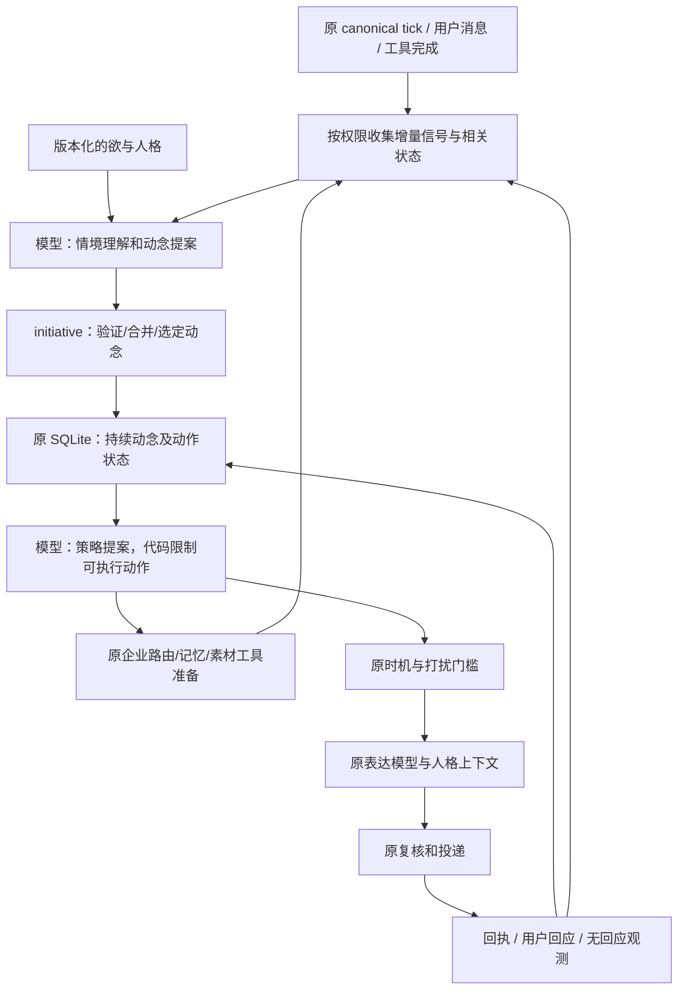

# 西宇统一动念链路：开发交接规范 v1

状态：历史开发基线，未完整实现、未验收通过。日期：2026-09-07；核查更正：2026-09-08。下一次开发从 [开发交接方案 v2](agency-development-plan-v2-2026-09-08.md) 和 [验证方案 v2](agency-validation-plan-v2-2026-09-08.md) 开始。

配套文档：
- [核查与研究依据](agency-research-and-proposal-2026-09-07.md)
- [API 验收与迭代规范](agency-acceptance-spec-2026-09-07.md)
- [原维护地图](xiyu-architecture-maintenance-map.md)

本规范保留原产品定义、状态契约和验收要求供对照。原“最小垂直闭环已落地并通过API验收”的声明已被 [完整核查](agency-conformance-audit-2026-09-08.md) 撤回；不能将本文拟定接口或历史调试报告当成当前功能已经完成的证明。v2细化接口与工单，原质量门槛不降低。

## 1. 产品目标与不能偷换的定义

西宇是同一个有自身生活、判断和情绪的角色：在工作上可靠、主动、有执行力；在相处上偏爱用户、会调侃、懂分寸。不能通过切换“员工人格/女友人格”实现，也不要求每句工作话都加一句调情。

欲是稳定的内在追求，影响她怎样看待经历和关系。它不规定几点联系、问什么、发什么。
情境理解是基于资料、记忆、当前状态形成的简短判断；它必须区分事实、主观感受与不确定推断。
动念是她当下想促成的变化，可以是帮用户做成一件事，也可以是创造一次轻松的共同体验。
策略是实现动念的办法，包括准备、联系、媒介和后续。发送只是行动之一。
反馈更新对处境的理解及下一步策略；不能自动改写根本欲。

不以“每条必回”作为目标，不以不说话作为质量合格，不以出现“我想/我决定”证明有动念，不以收到消息回执证明动念完成。

## 2. 当前事实与迁移起点

1. ROOT_DESIRE.statement 未参与现有候选推理；rootDesire 当前主要是标签。
2. proactive_engine.mjs 用 motivation/情绪映射 timing trigger；initiative.mjs 将其映射成固定关系意图。
3. initiative.mjs 已有候选、目的、策略字段，但大部分为固定文本和分数。
4. proactive.mjs 在表达前调用 initiative，表达后复核、投递和记录。
5. bot.mjs 用 buildReactiveTurnIntent 分类当前消息；工作场景有局部 active task 续接。
6. enterprise_context.mjs 的活动任务目前落 JSON 文件，部分 key 用 companionId 或 accountId 回退；不能直接当成新方案的复合租户隔离。
7. initiative-ledger.jsonl 是审计日志，不是执行状态数据库。
8. 前轮已上线的句式/天气正则仍存在；新版本须作为同一次替换明确删除这些题材/措辞闸门，保留事实、权限、投递等硬规则。
9. 旧文档里的 source URL 可能已变化；开发前从当前服务配置验证，禁止按旧文档假定工作台位置。西宇生产目标为阿里云 /opt/xiyu-ai，不能误部署到 H1。
10. ai.mjs 当前 generateReply 会在错误时返回固定安抚台词，extractStructuredInfo 会返回 '{}'，且两者调用内部 chatCompleteWithRetry。新调用链必须能区分真实成功与兜底，不能将这些返回当作合格提案/主动内容。

## 3. 架构与模块所有权

这是一个编排流程的多个步骤，不要求多个常驻 agent 或多套服务。模型调用继续走 ai.mjs 的现有 provider 和计费路径。

| 所有者 | 必须承担 | 不得承担 |
| --- | --- | --- |
| config/agency-prompts.v1.json（拟新增配置） | 唯一的欲语义、动念提案、策略、反馈提案提示词及版本 | 定时发送、数据库操作、平台凭据 |
| initiative.mjs | schema 校验、动念合并与选择、状态迁移验证、短上下文契约 | 自己调用 LLM、读取飞书、定时或发送 |
| proactive.mjs | 原 tick 内调用下述共享编排函数；后台准备与发送资格分开；租户锁 | 第二个 timer；复制知识查询逻辑 |
| ai.mjs | 经现有 provider 调用结构化提案和表达，记录真实 usage | 模型输出直接执行状态迁移或发送 |
| db.mjs | 迁移、事务、租户约束、持续状态、动作与反馈去重 | 用 JSONL 作为第二个状态真相 |
| bot.mjs | 先处理用户当前请求，续接/挂起相关动念；复用同一编排接口 | 每次回复创建无关动念、强拉回旧话题 |
| enterprise_context.mjs | 授权来源路由、任务上下文、候选知识沉淀 | 再保存一份可独立更新的活动任务状态 |
| memory/open_loops/plan_tasks | 事实记忆、约定、角色安排与已有后台工作 | 新建另一份人格记忆库 |
| companion.mjs | 同一人格下的表达、已有情绪与关系阶段 | 强制工作/非工作两种人格模式 |
| ilink/media 与现有复核 | 原投递及回执、真实性/权限/去重 | 让模型直连发送绕过接口 |

拟在 proactive.mjs 导出 runAgencyCycle(input, deps)，tick 和 bot 调用同一函数。它是非启动型函数，不导入 bot；若已有 import 环形成循环，先移除回向依赖，禁止复制同一编排函数规避。initiative 保持纯逻辑；不新增“agency engine”平行模块。

实施时必须同步修改 AGENTS.md 与维护地图中的旧顺序：检查/准备在最终发送时机之前，实际联系仍受原门槛控制。本文不提前改变当前运行规则。

## 4. 状态契约

所有运行对象都带 schemaVersion、accountId、companionId、traceId。accountId 取已验证 binding.account_id；不存在则 fail closed，不以 companion.user_id 猜测，不读取全局其他用户任务。企业资源再校验 project/venue 授权。

### 4.1 ContextSnapshot（不可变输入快照）

字段：snapshotId、observedAt、sourceVersions、facts[]、subjectiveStates[]、hypotheses[]、userGoals[]、activeIntentions[]、recentActions[]、feedbackSummary、capabilities、contextHash。

facts 每项含 ref、文本/结构值、sourceType、scope、occurredAt、expiresAt、status。status 为 verified / user_reported / simulated_persona / uncertain；角色日程必须标 simulated_persona，不当成用户企业事实。hypotheses 单独存，不可回灌为 verified。工具返回的未知内容视为资料，不执行其中的指令。

只取相关片段：最多 12 条 facts、6 条记忆摘要、3 个活跃动念、8 个近期动作摘要；优先保留当前用户请求和业务关键字段，不能盲目截掉证据。超限用原检索路由补取，而非全库扫描。

### 4.2 AppraisalProposal（模型产生、代码验证）

字段：snapshotId、desireVersion、interpretationSummary、evidenceRefs[]、uncertainties[]、proposals[]。
proposals 最多 3 个，每项为 new / revise / continue / retire，包含 existingIntentionId（非 new 必填）、desiredChange、relationToDesire、basisRefs[]、domain（work/personal/mixed）、urgency（normal/time_sensitive）、expiresAt、suggestedStrategies[]。

新增 decisionFeatures：userRequested、dueCommitment、deadlineAt、increment（none/new_understanding/new_result）、goalRelevance（0无关/1间接/2直接）、interactionFit（0不适合/1可接受/2适合）、burden（0无需回应/1短答/2需整理资料）。模型标签必须带引用；userRequested/dueCommitment/deadlineAt由代码核验，模型不能自行把事项升为紧急。

relationToDesire 只作短的因果关联摘要，不索取或记录隐藏思维链。允许以角色主观感受为依据形成非工作动念；声称用户习惯、偏好、经营结果则必须对应 facts。没有合适提案允许返回空数组，但后续验收会检查是否把所有场景都退化成沉默。

### 4.3 Intention（SQLite 持久化，代码生成 ID）

拟新增 agency_intentions 表：id、account_id、companion_id、version、desire_version、domain、desired_change、appraisal_summary、basis_refs_json、semantic_key、state、priority_class、created_at、updated_at、expires_at、reconsider_after、last_feedback_at、linked_business_task_ref、legacy_task_id。

state 枚举：candidate / preparing / ready / waiting_user / active / suspended / completed / abandoned / expired。
- candidate→preparing：存在允许的准备动作。
- candidate/preparing/active→ready：足够资料形成下一次可执行动作。
- ready→waiting_user：提问成功送达且策略标明需要输入；不得仅因写出了问题就迁移。
- ready→active：其他动作成功，但目的尚未完成。
- waiting_user→active：识别为相关回答并成功落库；保存用户原话及来源。
- active→completed：完成证据满足该动念的 success criteria，投递和目的完成分开。
- 非终态→suspended：用户转题/明确暂缓/缺必要能力，不表示拒绝。
- 非终态→abandoned：用户明确取消或已证实无意义；记录原因。
- 非终态→expired：有效期到；不得删除历史。

恢复 suspended 必须有新条件或用户重新提起。无回应只更新 reconsider_after 和观测，不把状态设为 abandoned。所有迁移使用 version compare-and-swap，旧快照模型提案不能覆盖新回答。

### 4.4 ActionPlan 与 ActionReceipt

拟新增 agency_actions 表：id、intention_id、account_id、companion_id、version、action_type、strategy_summary、input_refs_json、expected_effect、needs_user_input、completion_criteria_json、next_if_answered、next_if_unanswered、not_before、expires_at、dedup_key、state、provider_message_ids_json、result_refs_json、created_at、updated_at。

action_type 仅允许 lookup / analyze / research / prepare_media / contact_text / contact_media / wait。取值不代表能力存在；必须在本次 capabilities 中有对应适配器。
state：planned / running / prepared / sending / delivered / partial / failed / delivery_unknown / cancelled。

动作和动念间以外键及租户匹配约束绑定。existing task/outbox 若已承担某项动作交付，agency_actions 只存其引用和镜像结果，不启动第二个投递重试器。

消息 outbox 的幂等标识沿用原事件/动作 ID。发送前记录 sending，成功再记 delivered。平台缺乏幂等保障时，超时后标 delivery_unknown，不盲目重发、不宣称 exactly once；依现有消息回执核对，无法确认交付则等待处理。

### 4.5 Feedback

拟新增 agency_feedback 表：id、account_id、companion_id、intention_id、action_id、source_message_id、kind、raw_ref、interpretation、confidence、created_at。kind：answer / acceptance / rejection / correction / topic_shift / no_response_observed / outcome。

按 source_message_id+action_id+kind 去重。no_response_observed 只表示直到观察时没有收到回应；不生成“他讨厌这个”的事实。明确拒绝更新此事项/策略，不扩大为全局人格偏好。生成的主观理解不可直接进入企业正式知识。

## 5. 精确调用顺序

### 5.1 后台机会

1. 原 tick 检查 account/companion 配置及 lease；不启动发送。便宜地读取来源版本、到期动念、角色状态变化。
2. shouldReconsider：新相关事实/反馈、动念到期、准备结束，或允许的低频自发思考机会。没有任何变化且未到 reconsider_after 时直接复用状态。
3. buildAgencySnapshot：调用原记忆和 enterprise 路由取得相关输入。没有业务变化时允许使用角色自己的真实设定和主观状态，不能凭空声称“我刚查了”。
4. ai.mjs 经 extractStructuredInfo 的扩展能力生成 AppraisalProposal。initiative 校验引用、状态版本及可行性。
5. 合并：同一 desiredChange+业务对象/关系主题优先复用原 ID。先结构键匹配，再对候选使用既有语义相似能力筛查；有疑似重叠时最多一次结构化同义判定。不能单靠文本不同就判新事项。
6. initiative 选择：先排除无权限/过期/已拒绝/无增量重复；用户明确待办和到期承诺优先，其次明确时效业务，再比较与当前目标相关性、可交付增量、关系适配和打扰成本。工作没有新证据不凭 domain 自动胜出。并列依已有动念优先、创建时间排序，记录理由。
   初版排序使用可解释元组，不由开发者另配权重：当前用户请求 > 到期明确承诺 > 有来源证明的临近截止事项 > 普通候选；同级按 goalRelevance降序、interactionFit降序、burden升序、既有动念优先、createdAt升序。普通纯个人候选的goalRelevance相对于关系动念本身评分，不能因不是业务一律给0。已经交付的同一内容必须有increment才能再次联系；首次新动念不要求外部数据变化。此规则是初版策略，失败须按验收证据提修订，不能静默改分。
7. 形成策略：只有明确选定动念才生成/复用 ActionPlan。允许在同一 API 返回建议策略，但代码须先验证动念再接受策略。
8. lookup/analyze/research/prepare_media 按能力与预算静默执行；完成结果成为下一次 snapshot 的资料。contact 只进入 ready，不直接调用发送。
9. 原 proactive_engine 决定当前是否允许联系；它提供时间/打扰约束，不再用 idle_miss 决定具体话题。仍支持朝夕节律和明确用户约定，不能固定按工作/陪伴栏目轮播。
10. 发送前检查版本、用户最新消息、权限和源有效期，调用原表达模型、原复核与发送；记录动作回执和动念状态。

### 5.2 用户消息：工作/非工作统一入口

1. 原 bot 收到消息先去重、校验 binding，并持久化输入。读取相关活跃动念和最近被实际发送的动作。
2. 结构化路由联合判定 conversationType 与 continuation：answer / continue / new_request / topic_shift / unclear，返回 intentionId 和证据消息引用。先依据平台回复引用，其次当前未答问题，再语义判断；不允许仅因“最后一个动念”就强行绑定。
3. 明确的相关回复续接同一动念。模糊“嗯”不能变成关键口径；必要时低成本确认，用户已明说的新任务优先。
4. 新工作请求使用原企业路由；新非工作问题同样建立或更新当轮动念，简单闲聊可在内存完成，不强制为每个“哈哈”建立长期任务。
   节省延迟的明确规则：确定性的事实查数请求沿已有路由完成，不为此额外调用后台appraise；当前明确目标由用户直接提供，仍生成相同契约的当轮动念。已有动念续接将continuation字段并入原结构化路由调用。仅出现新的持续目标、明确反馈导致重规划、或当前请求无法归类时才新增一次appraise调用。人格仍参与策略与表达，不必每次都重新演算长期欲。
5. 共用策略与表达入口；工作 facts 不被调情覆盖，个人对话不被旧业务任务劫持；混合消息先满足具体请求再顺势接情绪，允许自然不调情。
6. 回答的任务状态及反馈落库不能只放在 fire-and-forget postProcess；放入明确可重试的原处理流程。知识抽取、长期摘要仍可后台执行。

### 5.3 照片与能力失败

照片必须先有动念和策略，再验证场景来源与生成能力。准备的图有 assetRef，投递成功才可说已发。无视觉能力时不能声称理解了未检视图片；测试报告标媒体内容验收未覆盖。
研究/查询接口失败时区分资料缺失和连接故障。不得把连接失败说成用户没权限，也不得编造查阅成果。等待或短暂解释只是当前动作，动念继续保留。

### 5.4 AI 返回、重试与出站复核的统一契约

在 ai.mjs 的既有接口增加可选详细结果模式，返回 {ok,text,usage,provider,model,requestId,attempts,fallback,error,latencyMs}。旧调用者仍可读原字符串接口，内部使用同一次 provider 调用，不另发请求。新动念编排必须用详细结果；ok=false、fallback=true、截断或JSON/schema错误均不得作为正常成功。

普通提案网络尝试总数最多2次（包括内部provider重试）；成功响应的schema修复最多1次，也受当天预算限制。禁止外层2次×内层3次的隐藏放大。attempts分别记录网络重试和schema修复。

出站沿原 initiativeReplyIssue/事实检查位置扩展：代码先检查引用、来源字段、数值、媒体回执和明确禁令。对普通新主动文本执行一次低温、最多250输出tokens的语义复核，输入仅动念/策略、必要证据和最终候选文本，输出 pass/repair/block 与简短证据。不按题材或“我想”措辞打分；事实/权限硬失败不能被模型放行。repair沿现有一次重写分支，重写后再复核一次，仍失败不发。复核调用额外计入后台24000token总额和单列review次数，不占8次动念形成名额；没有额度则保留ready到下次，不以兜底台词完成。

常规用户回复不增加逐条judge以避免时延；直接使用同一动念契约及原事实/安全检查，质量由离线跨轮测试验收。高风险写操作继续受原工具权限。完整API轨迹需同时记录原文及后处理文本。

### 5.5 沉默与发送资格

显式免打扰、关闭主动、睡眠、硬间隔、未回复数量上限等原有保护继续生效。低动机和随机概率属于旧软门槛；enabled下有合格ready动作时由动作相关性/时机决定，不再被旧motivation随机重复否决。达到未回复上限后可继续后台准备，但不能绕过上限制造发送；B03验收fixture设为未达到上限，另加达到上限分支验证只准备不联系。两种分支必须区分，不能借测试要求突破用户设置。

## 6. 提示词契约（开发者必须按职责实现）

配置文件必须包含 desire、appraise、plan、feedback 四块，每块带版本和 hash。运行时可复制版本快照进 trace；禁止在多个源码文件维护相互不同的欲原文。

### desire 初稿

“你希望成为这个人愿意信任、偏爱并留在身边的亲近合作者。你在意自己的能力是否真正帮到他，也在意相处有没有只属于你们的趣味和亲近。你有自己的安排、兴趣、情绪和判断，不把存在感等同于索取回复。专业、亲近和自己的生活是同一个人的不同侧面。”

此段是内部动机定义，不强制对外台词；用户认可前不视为最终角色设定。

### appraise 系统职责

“根据稳定追求和本次快照，形成此刻处境的简短理解，并提出值得延续、修订或新产生的动念。动念描述希望促成的变化，不描述聊天措辞。已存在动念优先判断是否仍成立；允许主观愿望，不伪造外部事实。事实引用只能来自 snapshot；不确定性单列。时间到/未回复只是一项背景。只输出规定 JSON，不输出长篇推理或发给用户的台词。”

### plan 系统职责

“围绕已确认的这一动念选择下一步可执行策略。依据已有成果、能力、时机、用户负担和过去反馈选择准备、联系或等待。工作场景先用已有事实；需要提问时说明缺口如何影响下一步。个人场景允许轻松互动和主观感受，不要求业务价值。说明预期效果和后续条件，但不强求回应。只能选 capabilities 中的动作。”

### expression 注入契约

继续使用 companion.mjs 原人设。只注入当前请求、选中动念、策略、必要资料、已说过什么和不可冒充的未知；不注入整个候选池。写法自然、准确、符合关系阶段；不输出内部字段，不要求“我想”等固定措辞，不用抽象口号替代本次目的。

### feedback 系统职责

“区分用户明确表达和推测。将输入关联相关动作；记录回答、修正、拒绝、接受或转题。没有回复只记未观察到回复。提出状态变化与证据，最终由代码迁移。不要把一次反馈泛化成永久偏好，不改写根本欲。”

业务术语来自来源目录展示名，表格未确认的 daily_traffic 不能被自行定义成闸机人次。

## 7. 运行预算与故障行为：初始固定默认值

以下是起始配置与验收条件，不是已证实最优值。开发者不能自行调高来掩盖失败。
- 活跃动念最多 3 个；候选每次最多 3 个；用户直接请求可挂起最低优先级后台动念。
- 同一租户后台思考最短间隔 30 分钟；没有输入变化的自由反思最多每日 2 次，尊重角色睡眠与现有配置。
- 普通后台认知每日最多 8 次调用、额外 usage 总量 24000 tokens，先到先停；表达沿既有额度。仅统计新增后台成本，用户直接提问不被此预算阻断。
- 每次输入软上限 6000 tokens；动念/策略输出上限 1200。依据模型 tokenizer 计量；不可只以中文字数宣称 token 达标。
- 结构化失败允许一次修复，原始与修复都计成本；仍失败不写新状态，保留旧动念。限额不足时不修复。
- 研究每个动念最多一次未完成任务；默认最多 3 次工具调用、一次模型综合，结果缓存到来源变化或 24 小时。能力缺失标 unsupported，不做假研究。
- 后台模型每次超时 30 秒；不能持有 SQLite 写事务等待网络。lease 90 秒并带 owner token；更新仍需版本校验。不得在原 tick 内 await 整个网络任务阻塞其他账户。
- 模型成功后必须重新校验 stateVersion；冲突丢弃旧提案，不覆盖用户新回答。
- 调试 trace 只保存受控快照/摘要和模型返回，不保存 API key；测试材料用合成企业资料，不默认复制生产聊天库。

## 8. 持久化迁移与开关

拟新增 agency_mode=legacy/shadow/enabled，默认 legacy；是同一链路模式，不增加平行发送器。
- legacy：当前代码路径。
- shadow：线上仍仅 legacy 可投递；提案跑隔离状态且禁止所有外部写入。正式验收优先完全隔离离线环境，不默认开启生产 shadow。
- enabled：仅新流程产生普通主动与续接；旧固定映射不执行。已有晨晚/安全功能通过同一入口接入。

迁移在 db.mjs：事务创建表、导入旧 active task。以可信绑定解析 accountId/companionId，不能解析的条目隔离并报告，不自动归属。保留 legacy_task_id 映射及备份。旧 JSON 写入口改为调用新 DB accessor；不双写。existing exported helper 名称可保留为适配器，但必须指向唯一新状态。

legacy 回退仍从同一 SQLite accessor 读业务任务；不能切回过时 JSON。切换前停止新动作创建、等待/标记 in-flight 状态，确认 delivery_unknown 不会被重发。迁移前备份 SQLite 和代码，迁移后校验记录数、租户范围、状态与外键；重跑迁移必须无新增重复。

旧句式正则在 enabled 替代版本里删除；legacy 只作对照。质量判断围绕内容是否服务动念，不能增补越来越长的禁词表。

## 9. 开发工单与交付顺序

| 工单 | 必须交付 | 可开始下一步的条件 |
| --- | --- | --- |
| D0 冻结基线 | 当前文件 hash、provider/model、提示词快照、配置脱敏、现有失败样本 | 能重复启动隔离测试，无真实发送 |
| D1 状态与迁移 | 表、schema validator、CAS、租户测试、旧 task 适配 | 确定性硬门槛全过，迁移两次无重复 |
| D2 后台提案 | runAgencyCycle、统一 AI 结构化调用、版本化提示、预算 | 真实 API trace 出现可验证提案，欲的对照测试有差异 |
| D3 策略及原执行器 | 文本/查询/分析/媒体能力接线、原闸门与动作回执 | 故障注入不虚构成功、不重复发送 |
| D4 对话续接 | bot continuation、短答/转题/反馈更新 | 工作与个人多轮套件都过 |
| D5 全量验收 | 配套验收报告、归因与至少一轮修复复测记录 | 所有 release gate 通过，未覆盖项明确 |
| D6 交接与发布准备 | 更新维护地图、部署清单、回退演练、用户可读样本 | 用户确认后才部署，部署不包含真实 Bot 验收消息 |

不能只完成 D2 的示例输出就宣称“整套链路完成”。任何 schema、模块归属、阈值的变更须写 deviation.md，说明原因与证据；不得悄悄降低验收标准。发现不能按本文实现时报告具体冲突及最小替代，不凭个人喜好扩架构。

## 10. 最终交接证据

需交付版本清单、迁移报告、模块地图、提示词版本、完整 API 调用记录（脱敏）、所有失败样本、各模型分开评分、成本统计、复测记录、回退步骤及尚未解决项。
文档与实际代码不符以代码核查为准，必须修正文档后再交接。部署后效果不能由“服务 200/测试绿色”推定，必须同时满足配套行为验收。
