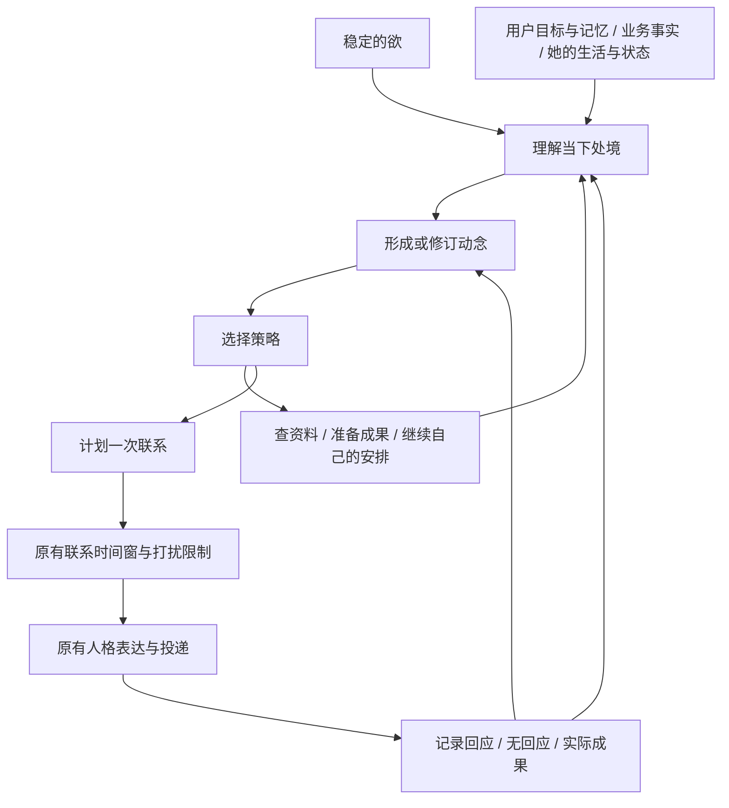

# 西宇：欲、动念与持续行动——核查、对标与方案

日期：2026-09-07。状态：研究与方案归档；原“最小闭环完成”结论已由2026-09-08核查撤回。本文仅保留当时研究依据，不代表对外部项目的最新复核或本项目已经完成。当前事实见 [完整核查](agency-conformance-audit-2026-09-08.md)，下一轮实施见 [开发方案 v2](agency-development-plan-v2-2026-09-08.md) 与 [验证方案 v2](agency-validation-plan-v2-2026-09-08.md)。

## 1. 保留的核查结论

- `src/initiative.mjs` 的 ROOT_DESIRE.statement 定义了根本追求，但当前候选生成只附加其 ID，没有根据其语义解释情境。只改这句话不会改变候选排序。
- 普通主动主要是联系机会到来后，根据 timing trigger 映射固定意图，再按预设分数选中候选。
- 策略、表达形式与目的大多预先绑定；模型主要负责文案，没有独立且可追踪的情境理解结果。
- 动念回执只有审计作用，不参与下一次决策。消息送达不等于目的达成。
- 普通回复经 buildReactiveTurnIntent 重新分类，没有普遍续接此前主动联系的动念；业务 active task 已有局部续接，应复用。
- prepare_silently 等字段本身不启动后台准备。不能把提示词中的动作名字当成已执行能力。
- 2026-09-07 22:21 上线的关系句式/天气正则限制仍在当前代码。它只能筛文案，且可能误杀正常表达；不能证明欲驱动动念已实现。本轮未撤回或变更。

## 2. 术语边界

欲是稳定的内在追求，不负责每条消息的时间、话题、动作和句式。欲通过影响她如何理解自身处境、用户和经历，影响动念的形成。

动念是她在这个情境中想促成的具体变化；策略是实现这个变化的办法；发送只是可选行动之一。一个动念可以跨几轮对话、几次准备和多个机会窗持续，也可以被修订、完成或放弃。

“情境理解”是可审计的简短判断摘要，记录依据与不确定性，不需要存储模型隐藏思维过程。主观感受可以由人格与状态生成；对用户和业务的事实断言必须有依据。

## 3. 对标研究：公开机制与可借鉴边界

检索日期同上。优先官方文档、论文、作者仓库和源码。不将产品宣传等同于生产可靠性，不以星标推断陪伴效果。本轮没有运行外部项目，源码只核查下列相关路径。

### BDI / Jason：持续意图与计划

官方教程区分 beliefs、desires、intentions，并通过适用计划执行已承诺目标。官方 commitment 模式讨论目标达成或不可实现之前如何保持意图。借鉴：动念有生命周期，换策略不必换动念；环境改变后可重新考虑。

术语不能照搬：BDI 的 desire 通常是可达到的目标状态，用户所说的恒定“欲”更接近长期动机；本文不声称两者一一对应。也不引入 Java/AgentSpeak 引擎。

来源：[官方教程](https://github.com/jason-lang/jason/blob/main/doc/tutorials/hello-bdi/readme.adoc)、[commitment 模式](https://jason-lang.github.io/jason/tech/patterns.html)。

### Generative Agents：经历成为理解，再参与计划

论文设计观察、记忆、反思、计划，包含消融评价。源码 reflect.py 按重要性累计触发反思，检索相关记忆，保存带证据节点的 thought；plan.py 包含是否交谈/反应的判断。借鉴：经历不直接变成一句分享，而应形成有依据的理解，随后影响行动。

边界：这是模拟环境研究，不能据此保证真实企业助理或长期陪伴效果。无须搬入整个小镇、人物群体和高频模拟。

来源：[论文](https://arxiv.org/abs/2304.03442)、[仓库](https://github.com/joonspk-research/generative_agents)、[reflect.py](https://raw.githubusercontent.com/joonspk-research/generative_agents/main/reverie/backend_server/persona/cognitive_modules/reflect.py)、[plan.py](https://raw.githubusercontent.com/joonspk-research/generative_agents/main/reverie/backend_server/persona/cognitive_modules/plan.py)。

### Letta：后台理解与即时对话分离

Sleep-time Compute 公开设计将后台记忆处理与主对话分开，持久状态承接后台成果。借鉴：用户不说话时可以整理已有信息，形成下次可用的理解；即时回复无需反复从原始历史推导。

边界：后台整理不是欲，也不自动产生有吸引力的动念；该文章中的研究结果不能直接外推到西宇。现阶段借鉴分工，不迁移整套 Letta 运行时。

来源：[官方文章](https://www.letta.com/blog/sleep-time-compute/)、[仓库](https://github.com/letta-ai/letta)。

### LangChain Ambient Agents：任务推进中的沟通与恢复

官方设计从事件流启动工作，区分 notify、question、review，并通过持久状态等待反馈。参考 email_assistant_hitl_memory.py 对用户回答、编辑等分支续接执行，并更新相应偏好。借鉴：先有在推进的事情，再因通知、缺口或决策需要联系，回答后恢复同一任务。

边界：代码里的 ignore 是用户显式操作，不能把微信未回复当成它。事件助理也不能覆盖角色主动寻求陪伴的全部动机。

来源：[官方设计](https://www.langchain.com/blog/introducing-ambient-agents)、[仓库](https://github.com/langchain-ai/agents-from-scratch)、[相关源码](https://raw.githubusercontent.com/langchain-ai/agents-from-scratch/main/src/email_assistant/email_assistant_hitl_memory.py)。

### ChatGPT Pulse：先准备个性化成果

公开产品逻辑是结合聊天、记忆、反馈和连接信息，异步研究后提供个性化更新。借鉴：用户不发指令也能先做准备，再交付可用内容。

边界：公开材料没有给出内部欲、候选打分或人格动念架构，不能推断它采用 BDI。日更卡片也不适合作为西宇自由陪伴的节奏模板。

来源：[官方介绍](https://openai.com/index/introducing-chatgpt-pulse/)。

### Open Deep Research：经营灵感的后续执行参考

将研究需求压缩成 brief，按需求深度搜集信息并压缩结果。适合在动念已明确“要研究什么、用于什么决策”后调用。不是人格中枢，也不应该每次主动联系都跑深度研究。

来源：[官方架构](https://www.langchain.com/blog/open-deep-research)、[仓库](https://github.com/langchain-ai/open_deep_research)。

## 4. 综合方案：沿现有模块补齐因果链

以下是根据研究和本地核查提出的方案，不是对外部产品内部实现的描述。

### 4.1 欲只进入情境理解与动念形成

稳定设定保留一个版本化原点：希望凭能力被信任，又希望以自身魅力被偏爱；有自己的生活与判断。专业和亲近是表现方向，不按固定时段轮播。

后台生成输入为稳定设定、少量相关上下文、现有未完成动念、反馈摘要。输出为简短情境理解、依据/不确定性、拟产生或修订的动念。稳定设定不写“必须发几条”“必须问什么”。

建议提示职责：结合已知处境说明她此刻在意什么，并形成一个具体想促成的变化；区分事实与感受；不得把联系时间到了直接作为动念；没有新外部事件也可从自己的愿望和已有相处关系产生动念；本阶段不写聊天台词。

### 4.2 动念具有连续身份

拟定最小字段：id、owner(account/companion)、desireVersion、情境理解摘要、sourceRefs、想促成的变化、状态、已尝试策略、已交付内容摘要、最近反馈、下一次考虑条件、有效期。

状态可为：候选、准备中、可联系、等待回应、进行中、完成、放弃、过期。状态变化需有依据；发送成功只更新投递状态，不自动完成动念。同一事项换说法不能生成一个全新的动念。

主动联系与用户后续对话共享 intentionId。用户转话题时先处理当前请求，原动念保留或挂起；不强迫用户回到旧话题。

### 4.3 策略在动念之后决定

分别考虑内容价值、关系适配、用户负担、素材可用性、已尝试方式和新进展。可以先查资料、给成果、分享观点、发情节照片、提出短问题或等待。消息条数和媒介服务于策略，不由欲或触发枚举直接决定。

表达模型只接收选中的动念、策略及必要证据，不塞入全部候选和研究历史。检查实际行动是否完成策略，避免用“我想/我决定”字样代替语义判断。抽象观点和天气可以是情境素材，不按题材一刀切。

### 4.4 不靠热情用户喂养

无新消息时仍可利用授权业务资料、岗位背景、角色自己的计划和现有理解。冷启动允许不确定的初步判断，但不能编造用户偏好。

无新资料时也不等于没有动念：她可决定创造一次轻松的共同体验，准备一个符合自己兴趣的小选择或情节，而不是被迫等待用户先开口。也不要求每条陪伴必须交付业务价值。

知识补全依托具体决策：先查已有来源，再评估缺失信息是否改变建议，以及用户角色是否适合回答。已经问出的信息关联原动念，回答之后给出它改变了什么。企业通用认知地图继续在原工作台模块维护。

### 4.5 反馈不能只看回复率

显式喜欢/不喜欢是强反馈；未回复只表示未观察到回应，不自动推断拒绝、忙碌或认可。后续联系需要新进展、不同策略或合理的新时机，不能持续复读同一要求。

业务看事实是否准确、任务是否推进、建议是否采纳；关系看是否自然、有针对性、用户愿不愿意继续以及显式感受。送达、回复、目的达成分开记录。反思可以调整策略偏好，不能自动改写根本欲或把推测写成企业事实。

## 5. 模块归属与改动范围

| 现有原点 | 拟调整 | 类型 |
| --- | --- | --- |
| initiative.mjs | 欲的定义、动念结构、结果校验、候选选择；去掉固定 trigger 等同于具体动念的映射 | 逻辑与提示职责 |
| proactive.mjs + ai.mjs | 原 canonical tick 编排受预算约束的后台理解/准备；沿既有 AI 客户端调用，不在 initiative 中新建模型客户端 | 逻辑 |
| proactive_engine.mjs | 保留联系资格、时间和打扰控制；不能用 motivation 直接替代动念内容 | 职责调整 |
| db.mjs + 既有任务状态 | 持久化动念状态与关联 ID；业务 active task 扩展复用，避免双份状态拥有同一任务 | 数据与迁移 |
| memory/open_loops/plan_tasks | 提供相关记忆、真实约定和角色安排；原存储承接反馈，不另建记忆系统 | 接线 |
| bot.mjs | 回复关联活跃动念并续接；允许转题及挂起 | 逻辑 |
| companion.mjs | 表达选定策略，压缩重复约束；保留日程和角色生活 | 提示词 |
| enterprise_context.mjs / 工作台 | 按动念所需资料路由与准备；保留事实来源、角色边界和回答后交付 | 接线与执行 |
| 既有回执与管理入口 | 显示情境依据、动念、策略、动作、反馈与状态；回执是审计，DB 是执行状态唯一原点 | 可观测性 |

这会修订现有“先时机再选目的”的职责：检查/准备机会可发生在发送资格之前；最终投递继续受原时机闸门控制。批准实施时同步更新维护地图并移除旧映射，不让两套路由竞争。第一阶段不引入 Letta、LangGraph 或 Jason 全套依赖。

## 6. Token 与复杂度控制

- 原 tick 先作低成本变化检查，按来源版本与摘要哈希避免对相同上下文重复推导。
- 无变化时仍保留低频反思机会，但不每个 tick 都调用模型；间隔、日预算和最大候选数需由隔离验证确定。
- 按需检索，先目录后片段；后台只给少量上下文，输出少量候选。经营研究有独立预算与缓存。
- 动念持续保存，不能每句话重新生成全部目的；普通回复主要读取当前动念。
- 可用一次结构化调用生成情境摘要、动念及候选策略，但字段和校验分开。执行前更新资料，表达复用已有调用。
- 记录实际模型输入输出 token、失败重试、单次交付成本；本轮不声称节省了多少。

## 7. 验证与实施顺序（待确认）

先完成可回放的样本，再决定开发与发布。现有 lint/确定性测试只能证明流程和规则，不能证明人格质量。

必须覆盖：冷启动无主动输入；两天沉默；同一观点曾被明确否定；业务资料不变；有日程而无新业务；用户短答知识问题；用户转题；查找失败；重启后续接。

关键验收：

1. 同样情境改变欲的设定，应在多次对照里出现动念方向差异；改变媒介条件只影响策略，不应无故改变欲或目的。
2. 连续相同资料不重复发送相同建议；新的证据或执行进展可作为同一动念的合理续接。
3. 不回复不能被记成拒绝；明确拒绝必须改变后续动作。
4. 用户回答问题后交付原任务的判断或下一步；业务未知不被人格化语气掩盖。
5. 主观表达允许多种句式；正常天气/生活素材不会因为词表被误杀。
6. 断点恢复不丢动念、不重复投递；情境来源和动作链可查。

建议先影子运行：使用授权 API 离线生成，禁止真实微信发送、不写真实聊天记忆；将旧版与新版跨轮样本、成本和失败原因交给用户评阅。通过后才替换旧路径并发布。前轮上线的正则限制应在这次替换中明确处置，不能无限叠加。

## 8. 本轮结论

选择“借鉴机制、原地补齐”而非整体拼装。优先完成欲参与理解、动念持久化、主动与回复续接三项；研究和照片是这些动念的执行手段。没有证据支持只调整两段提示词即可达到目标，也没有必要为此重建全部后端。
