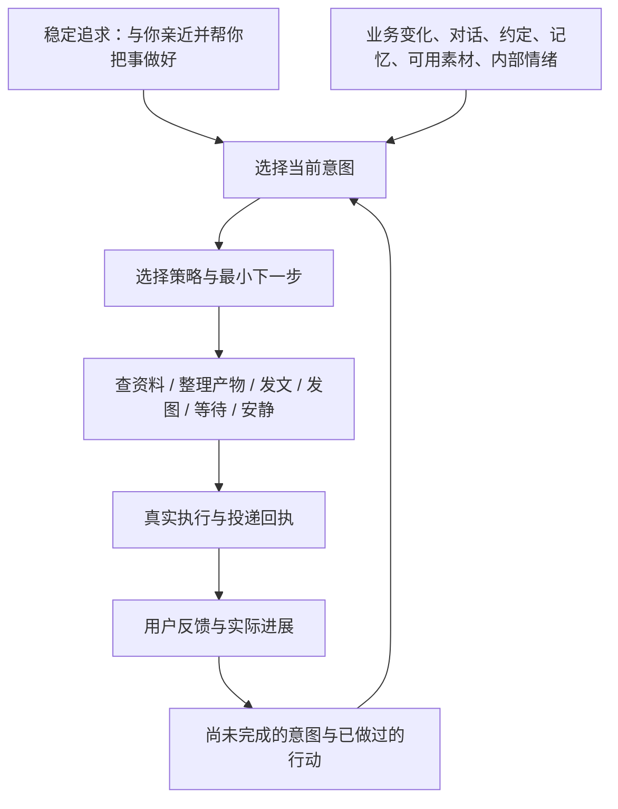

# 从定时搭话到持续意图：溪语主动性诊断与社区选型

日期：2026-09-06，核查时间约北京时间 11:25–11:40。

状态：本轮完成真实运行诊断、社区源码调查和第一层改造。已新增纯逻辑 `src/initiative.mjs`，并接入现有主动发送链：排程层选出的时机不再被丢弃，生成前必须形成目的、依据、动作、成功条件、回复负担和失败分支；发送结果写入本地 JSONL 回执。未开启业务自动外发、未运行或安装第三方项目。跨重启持续推进的完整意图状态机、后台业务监控与行动工具规划仍未完成，下文后续阶段不能当作已有能力。

## 1. 用户要的角色

她有一个相对恒定的内在追求：希望与你亲近，也希望你的事因为她的参与而变得更好。帮助完成工作、让你愿意开始工作、与你分享和玩闹，都是这个追求在具体情境中的表现。

“恒定”指跨多次对话稳定，不是永不允许用户修改，也不是永远维持同样强度。“动念”是这次想促成什么变化；“意图”是决定持续投入到哪件事；“执行”包括查资料、整理材料、发图、发一句话、连续几条、等待或保持安静。复盘关注是否帮到人以及表达是否被接受。

必须避免把欲求降格成“想念分数”，或把陪伴目标变成追求回复率、在线时长和反复催促。允许没有外部大事件也想亲近，但不能为此编造看过的图、发生的同事事件、已经完成的业务动作。

她的稳定追求不应该每次说给用户听；用户应从行动的连贯性体会到。一次互动也可以同时兼有业务与陪伴意图，例如先替用户拆小一个卡住的任务，再用合适的亲近表达陪他开工。

### 冷启动是默认条件，不是异常情况

真实工作场景应默认用户没有时间培养角色：他可能很少主动联系，不先交个人资料，也不会为了完善记忆回答一串问题。系统不能把“先告诉我更多，我才能帮你”当作起点，更不能用暧昧、卖惨或催回复维持关系。

第一原则是先给价值、降低负担。用户不欠初始化、不欠情绪投入，也不欠回复。每次联系都把打扰成本计入选择；能先查、先整理、先等待的，就先完成这些动作。只有已有真实依据、能交付一点结果、存在值得关心的约定，或一次无需回应的轻陪伴确有意义时，才联系用户。

冷启动分三步推进：

1. **观察与安静准备**：只用已有对话、已授权业务源、时间和明确事件建立最小认识；不推断私生活，不用模型编生活素材，不为了“刷存在感”必发消息。
2. **低负担接触**：优先交付一个可直接使用的小结果，或只问一个会改变下一步的真实问题。偏好确认尽量是一句话、一选一，也允许用户不回答。
3. **从实际反馈学习协作**：根据用户采用、纠正、拒绝和任务结果调整策略。没有回复只表示当前没有反馈，不自动判定拒绝、关系下降或需要加大发送强度。

关系应从可靠、有分寸、偶尔有趣的共同经历里生长。业务帮助不以谈情说爱为前置条件，陪伴也不把用户持续提供信息当作入场券。

## 2. 今早到底发生了什么

只读读取生产 SQLite，未导入会执行迁移的 db.mjs；日志按 UTC+8 对齐截图。

| 时间 | 实际链路 | 确认的问题 |
| --- | --- | --- |
| 07:26 | sleep 起床兜底 → morning → 1 条文字，0 图 | 来自角色起床流程，不是对用户状态或业务机会的主动选择；“醒这么早”未经本条链路证明用户已醒 |
| 09:06 | 原计划 normal 经 v2 放行 → 通用主动提示词 → 1 条文字，0 图 | 通用提示词明确要求随机挑情绪、抱怨或碎片话题，并直接举“同事”的例子；没有可审计的目的与下一步 |
| 10:37 | 另一个延期 normal 时点经 v2 放行 → 同一通用生成分支 | 声称看到表情包但没有发图；启动日志明确记录 manifest 缺失，尽管角色表情开关为开 |

生产策略：全局 XIYU_ENTERPRISE_PROACTIVE_ENABLED=true，但当前角色业务策略 enabled=0、report_enabled=0、knowledge_enabled=0；所有业务检查/发送时间为空，updated_at=2026-09-05 02:32:01 UTC。因此不能把这次无业务归因于模型没选中或用户没配合。

更重要的结构性断点：

1. evaluateProactive 返回 trigger/message/motivation，但 tick 只利用是否为 null 作放行判断，没有把它选出的意图交给最终生成器。
2. 动力分数主要是时间×情绪×日程×随机扰动，加想念微调。它解决“现在有没有空/动力发”，不解决“为什么值得发、想促成什么”。
3. 业务事件只能搭乘 normal 触达机会；普通聊天没到发送时机，就不会先检查经营变化。监控和通知没有分开。
4. 正常业务 purposes 只有 daily_report 与 knowledge_acquisition。工作台的 signal_followup、validation_followup 生成当前只在 legacyAll 分支，因此仅打开开关也不能补成完整的监控—理解—建议—执行跟进。
5. 反重复提示要求每次换全新话题，可能反而破坏对同一业务/情感意图的连续推进。应禁止同一进展重复打扰，允许同一目标有新进展时继续。
6. 文本按分隔符拆成若干条；素材与工具尚未成为行动计划。没有“这次为逗笑分享这张真实可用的图，图没发成就不能算完成”的统一验收。
7. 图像单独发送原有一处回执风险：sentAnySegment 只在文字成功时置真，而 sticker 计数在真正发出前增加。本轮已修正为图片实际成功后再计数并置为已投递；纯图可成立，部分失败写入独立意图回执。

上午 11:09 的日志显示用户主动问业务时，语义路由与单日来源查询确实执行了。这说明上轮查数能力已经可用；问题是没有被一个持续主动意图系统调动起来。上轮验收覆盖了隔离链路，未覆盖“日常真实触达是否承担角色职责”，不能用之前的 passed 否定用户这次体验。

本地证据：

- src/proactive.mjs：enterprisePurposesDue、tick 的 v2 与业务分支、normal 提示词、投递循环。
- src/proactive_engine.mjs：computeProactiveMotivation、selectProactiveTrigger、buildProactiveIntent、evaluateProactive。
- src/stickers.mjs：manifest 读取和可用性判定。
- 工作台 backend/feishu-sync-server.mjs：refreshEnterpriseEvents 的 purposes/legacyAll 分支。
- docs/validation/2026-09-06/proactive-intent-audit.json；scripts/audit_proactive_intent.mjs 可重新只读运行。

## 3. 社区调查

统计为本次 GitHub API 快照。Stars 表示关注度，不等于陪伴效果或满意度评分。检查了当前源码、测试文件、维护时间及最近关闭条目；没有安装五套系统或执行它们的测试，不声称已体验优于溪语。

| 项目 | Stars | 本次确认的价值 | 接入判断 |
| --- | ---: | --- | --- |
| [N.E.K.O.](https://github.com/Project-N-E-K-O/N.E.K.O) | 2,749 | 最接近产品形态：主动陪伴、多媒体素材、工具执行；主动域已有分阶段决策和投递结果 | 作为首要产品/流程对标，借鉴边界，不换整个平台 |
| [MaiBot](https://github.com/Mai-with-u/MaiBot) | 5,886 | 规划器选择行动；回复、图片、表情、等待是工具；有后续回复效果归因与评价 | 借鉴规划与表达分离、行为工具和反馈设计 |
| [AIRI](https://github.com/moeru-ai/airi) | 48,811 | Spark 事件可以产生角色反应、指令或无回复；命令包括优先级、计划、预期结果、后备步骤 | 借鉴事件契约和行动编排，不引入头像/游戏整套依赖 |
| [OpenClaw](https://docs.openclaw.ai/gateway/heartbeat) | 388,979 | 心跳运行与是否通知分开；轻上下文、静默结果及后台工作交接 | 借鉴监控、安静做事和回执，不把它当角色人格引擎 |
| [Generative Agents](https://github.com/joonspk-research/generative_agents) | 22,066 | 观察、检索、计划、执行、反思的可研究实现 | 理论/机制参考；主分支提交停留在2023年，不适合直接接到当前微信生产服务 |

### 可借鉴的源码证据

N.E.K.O. 的 [主动域设计](https://github.com/Project-N-E-K-O/N.E.K.O/blob/main/docs/design/proactive-chat-domain-refactor-design.md) 和 contracts/decisions/delivery 分开了素材选择、活动时机、模型决策、生成、重复检查和投递；有 PASS_SOURCE_EMPTY、PASS_MODEL_PASS、DELIVERY_FAILED 等结果。当前已检查的流程仍以场景和来源选择为主，不能据此宣称已有满足我们需求的长期欲求账本。

MaiBot 的 [规划提示词](https://github.com/Mai-with-u/MaiBot/blob/main/prompts/zh-CN/maisaka_chat.prompt) 明确先决定下一步行为，发言由 reply 工具负责；其 builtin_tool 下有 send_image、send_emoji、wait。reply_effect/scoring.py 区分推进、维持、误推进等贡献，并保存评价可靠性；[官方说明](https://docs.mai-mai.org/manual/webui/chat-stats) 对无关联信息和不完整观察不强行给出确定评分。不能直接把群聊回应深度评分拿来优化一对一亲密关系。

AIRI 的 [Spark Agent](https://github.com/moeru-ai/airi/blob/main/packages/core-agent/src/agents/spark-notify/agent.ts) 默认允许无回复，并能向子模块发命令；schema 有计划步骤、触发条件、预期结果和后备方案。它证明“收到事件后可以行动而不讲话”有现成工程实践，但不等于已完成企业目标与关系目标的统一调度。

OpenClaw 的 [Heartbeat](https://docs.openclaw.ai/gateway/heartbeat) 支持可见通知与静默结果分离，介绍了轻量上下文与会话隔离；心跳本身与持久后台任务也有区别。借这个职责划分即可，不需要把整个执行框架塞进溪语。

Generative Agents 的 [论文](https://arxiv.org/abs/2304.03442) 与 cognitive_modules/plan.py、reflect.py 提供跨时段计划、对变化反应及反思。它是模拟环境研究，不是开箱可用的企业伴侣方案。

用户所说的“欲→动念→执行”与 BDI 的分层很接近：[Jason 官方教程](https://github.com/jason-lang/jason/blob/main/doc/tutorials/hello-bdi/readme.adoc) 将环境认识、欲求和已承诺执行的计划分开。这里借鉴概念，不引入 Java/AgentSpeak，也不声称实现了人的主观欲望。

### 维护与许可证记录

AIRI、MaiBot、N.E.K.O. 与 OpenClaw 近期仍有维护；抽查有测试和修复活动。Generative Agents 的仓库 pushed_at 与主分支最后提交时间不同，不能只看 pushed_at 宣称现代化维护。

快照许可证：AIRI MIT；N.E.K.O. Apache-2.0；MaiBot GPL-3.0；Generative Agents Apache-2.0。OpenClaw API 返回 NOASSERTION，但本次直接读取 LICENSE 为 MIT。当前选择独立实现所需机制，不复制这些项目代码到溪语，不把许可证判断当成现成集成许可结论。

原始元数据、所读源码、测试及近期关闭条目保存在 E:/FoxSpirit/data/proactive-research-20260906。记录的分支提交：AIRI f166736、MaiBot 2783653、N.E.K.O. e1fa348、Generative Agents fe05a71、OpenClaw 23fda78。源码读取发生在本次调查窗口，main 可能继续更新。

## 4. 决策：保留溪语，新增统一主动决策层

不直接拼装完整平台。我们已经有微信投递、人格、记忆、情绪、睡眠、图像、工作查询、知识审核和任务引用，替换框架会重复建设并丢失已有业务适配。需要的是局部架构调整，不能靠改几段提示词和开业务开关完成。

### 四层职责

1. **欲求层**：用户认可的稳定人格目标。工作有效性、关系亲近与体贴共同存在；不由一夜的回复率任意改写。
2. **意图层**：例如“让他容易开始这件事”“把这个经营风险核实清楚”“兑现昨天承诺”“分享能一起笑的东西”。一个意图可以跨多次联系存在。
3. **策略与执行层**：决定先查再说、先陪一下再提一个小步骤、发真实图片、只发一句、分两条，或等对方有空。生成器负责表达这个已选策略，而不是生成后再补一个动机解释。
4. **反馈层**：记录执行成功、内容被接受、被纠正、被拒绝、无反馈或仍待观察。无回复不自动等于失败；任务完成也不等于一定要再发一条邀功。

### 最小持久对象

| 对象 | 必须记录 | 作用 |
| --- | --- | --- |
| Drive | 目标、适用角色、稳定权重、用户边界 | 解释长期方向 |
| Intention | driveRefs、具体想促成的变化、来源引用、范围、有效期、状态 | 保留跨轮连续性 |
| PlanStep | 采取何种动作、工具参数、需要的素材、成功条件、失败分支 | 决定说什么以及做什么 |
| ActionReceipt | 实际查到/生成/发送的结果，部分失败状态，幂等ID | 区分想做、尝试、成功 |
| Feedback | 关联哪次意图、用户明确反馈、实际业务进展、观察置信度 | 调整策略而非盲目增加频次 |

Intention 状态建议：candidate→selected→preparing→ready→waiting_user/observing→satisfied；并允许 paused、expired、cancelled。消息送达只推进执行状态，不直接把整个意图标完成。

### 业务与陪伴如何选，不用固定比例

每天独立做轻量业务检查，先按来源更新时间/指纹判断是否有变化；有变化才按路由取少量事实并理解。没有可行动变化时安静，不拿历史异常伪造今天的新问题。

再把真实业务机会、未完成任务、陪伴动念放进同一个候选集合，按目标贡献、紧迫程度、关系时机、证据充分度和打扰成本选一个下一步。业务重要不等于每次先讲业务，用户累也不等于停止后台准备。

“想亲近”本身可以产生轻联系，不强求每次都找外部理由；但这次要知道是在逗趣、分享、轻陪伴还是回应一个牵挂。没有适合行动时可以不发。持续目标允许同一话题有新进展，不再强迫每次换一个生活段子。

### 载体必须由策略与能力共同决定

先确认素材或产物实际可用，再选择 text/image/link/task_card/wait。微信当前代码明确不提供 bot outbound voice，第一版不能把语音当已支持；浏览器语音可以保持独立能力。

“想分享表情包”应先选到一张真实素材，再发送并核对图的投递回执。找不到图可以改成另一种轻松互动，不能口头声称已经看到了图。图失败、文字成功是部分成功，不能把整次分享记成完成。

## 5. 用今早三个时点做设计验收

以下为新架构的候选行为示例，不表示今早真实存在这些事件，也不是将来固定套用的话术。

- 07:26：她想与你开始新一天，但没有用户已醒证据，就不写“醒这么早”。可留一句无需即时回复的轻问候，或等到合适时机；不因自己的起床兜底必发业务问题。
- 09:06：若业务来源确有新变化，先核实并准备一个最小可执行的下一步，再联系；若没有，则可延续真实牵挂或主动分享，不编一位烦人的同事补空档。
- 10:37：若动念是一起笑，实际发出合适图片或明确能参与的小互动；用户没回复也允许收住。判断“有没有实现分享”，不只判断“文字有没有发出去”。

业务与情绪结合的假设场景：用户明确说任务太大不想动→她的意图是降低开工阻力→后台将任务整理成一个十分钟可完成的步骤→轻松地把这一步交给用户，愿意才继续→观察是否开工或是否希望只陪伴。不把撒娇设置为用户完成工作的奖励。

## 6. 可直接交付的实施任务

| 阶段 | 改动落点 | 交付与验收 |
| --- | --- | --- |
| A 真实状态可见 | 业务策略配置、proactive_health、工作台事件刷新 | 显示业务为何未检查/未联系；区分 monitor 与 notify；明确接通 signal 与 validation purpose，不能只测日报和补问 |
| B 意图账本与统一选择 | 新纯逻辑 initiative 模块、持久状态、proactive.mjs 接口 | **已完成第一层**：v2 时机信号接入、每次生成前选意图、本地 selected/delivered/blocked/failed/partial 回执；**待完成**：跨重启恢复未完成意图，调度失败不消费意图 |
| C 行动规划与表达 | 主动生成入口、企业提示词、媒体适配器 | 模型先产结构化最小计划，再表达人格；可先工作不联系；图/文分别有成功回执；待办/产物引用可验证 |
| D 双领域跟进 | bot 回答处理、企业候选/任务桥、open loops | 明确回复关联上一意图；部分回答不误完成；跨话题暂停，回来继续；不把生活事实写进企业库 |
| E 复盘与可观察性 | 只读意图时间线、反馈记录、离线回放 | 查看“为什么动念、为何选择、实际做了什么、为何没发”；反馈只影响后续策略，不自动改根本人格 |

本轮用离线测试完成第一层接线，没有触发微信发送、正式知识写入或真实任务提交。后续后台监控和行动规划仍应先影子运行与隔离回放。最终让用户审阅的是具体行为轨迹与样本，而不是只看 JSON 字段或模型自己解释“有意图”。

### 本轮已落地的改动

- `src/initiative.mjs`：定义两项稳定追求，并根据业务事件、真实跟进事项、真实素材、早安和四类内部时机分别选择单一目的。普通联系会区分“间隔后留门”“自己承担的情绪表达”“低负担求助入口”“无外部素材的轻互动”；冷启动一律低负担。
- `src/proactive.mjs`：把 `evaluateProactive()` 的 timingDecision 传入生成层；删除随机编同事、外卖、视频和表情包的通用提示；重复检测只改表达，不再强迫换掉正在推进的目的。
- 生成前复核无来源的“刚看到/刚听说/同事/表情包”等叙述、催回复和冷启动亲密越界；复核失败只允许围绕同一意图重写一次，仍失败就不发。
- 投递后在 `data/initiative-ledger.jsonl` 记录安全摘要，不保存完整私聊正文；图片区分实际成功、部分成功和失败。
- `scripts/initiative_smoke.mjs` 覆盖冷启动、虚构由头、早安不假设用户已醒、业务目的、媒体回执和持久回执。

首次运行重启暴露了真实失败：14:20 服务追发 12:32 的旧时段，并送达“今天周末，图书馆人不多，好安静呀”。该句没有可核验场景来源，不能算通过。本轮继续修复为普通时段超过 30 分钟即作废，并把无来源地点/公司/天气等场景陈述加入复核；失败样本已固化进测试。完整记录见 `docs/validation/2026-09-06/initiative-cold-start-validation.md`。

### 必须通过的验收场景

1. 有新业务事件且可执行：能先查、形成下一步，不继续随机闲聊；事件未发生或数据过期时不编造。
2. 业务监控开启但通知暂缓：后台可完成读取/准备，用户不收到每次检查播报。
3. 用户明确只想被哄：暂停业务催问，允许轻松陪伴；未完成工作意图仍保留。
4. 同一任务新进展：可继续原话题；只有同义重复且无新进展才抑制。
5. 没有图或工具不可用：切换可执行策略或等待，不生成空口承诺；纯图与部分投递状态准确。
6. 用户没有回复：允许等待、不解读为拒绝或失败，不制造压力来换回复。
7. 有明确拒绝/不合适反馈：暂停对应策略，保留范围与时间，不自动把一次拒绝泛化到所有业务帮助。
8. 睡眠、忙碌、配额、重启、网络失败：保留意图、有效期和幂等回执，不能重启重发整套内容。
9. Token：空检查不调用大模型，候选用短摘要，只有选中意图取详细资料；独立记录规划、取数、表达三类开销。
10. 跨上午/下午的回放有连贯目的，业务和陪伴均有实际结果；不能用“每条有 intent 字段”作为真人感验收。

本轮选型结果：借鉴 N.E.K.O. 的主动域分层、MaiBot 的规划/行为工具及反馈、AIRI 的事件契约、OpenClaw 的监控通知分离；在溪语现有架构内独立实现稳定欲求与持久意图的薄层。改动集中在主动决策和行为闭环，保留现有平台与业务能力。
